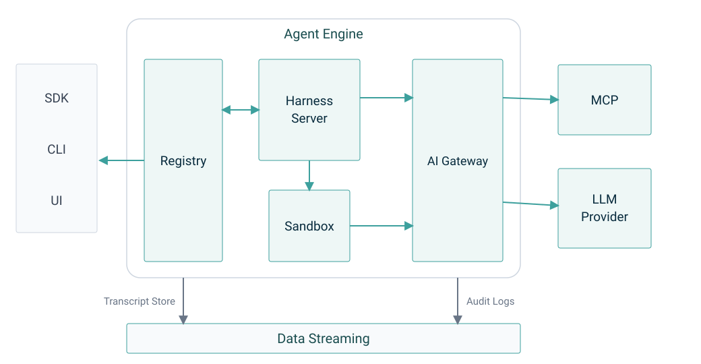

# Orca Agent Engine

Orca Agent Engine is a self-hosted implementation of the managed-agents API: you define agents,
run them in sessions, and stream each session's events. It follows Anthropic's Managed Agents beta
(`managed-agents-2026-04-01`) closely enough that the official Anthropic SDKs can use it by changing
their base URL. Agents, sessions, events, files, memory and credentials stay in infrastructure you
operate.

It has four parts:

- **A registry**: the public, Anthropic-compatible REST and SSE API, and the control plane. It keeps
  its metadata in Postgres.
- **A harness runtime** that runs each session's agent loop: `harness-server`, or a session runner
  that dials the registry, including on machines you attach as self-hosted environments.
- **Pluggable sandboxes** where session code runs: local OS sandboxing, E2B, OpenSandbox, AgentENV,
  or an in-memory sandbox for tests.
- **Egress through the AI gateway.** MCP tool calls, and model calls when configured, leave through
  the AI gateway, which injects vault credentials so that they never enter the sandbox. The gateway
  is published as the image `ghcr.io/orca-ae/orca-ai-gateway`.

Session transcripts stream through Kafka (the default), Postgres or Pulsar. Files, memory and
skills live in S3-compatible object storage.

<picture>
  <source media="(prefers-color-scheme: dark)" srcset="docs/images/agent-engine-architecture-dark.svg">
  
</picture>

<sub>The diagram shows the `colocated` model path, where the harness runs inside the sandbox and
reaches the model through the AI gateway. In a cloud `separate` session the agent loop runs in
harness-server, which calls the model provider directly unless the deployment
(`LLM_EGRESS_DEFAULT`) or the session (`metadata.orca_llm_egress`) selects the gateway. MCP tool
calls go through the gateway in both modes.</sub>

## Status

Orca Agent Engine is a developer preview. The current release line is 0.5.x. APIs, configuration
and storage formats can change between minor releases.
[`docs/compatibility.md`](docs/compatibility.md) lists the versions of the AI gateway, the `ork` CLI
and the TypeScript SDK that were tested with this release.

## Quick start

Neither path below needs a model API key.

You need:

- Docker with the Compose plugin
- Node.js 22 (22.21 or later) or Node.js 24.9 or later, and pnpm 9 (`npm install -g pnpm@9.15.9`)
- `openssl`, `curl` and `lsof`
- A C++ toolchain and Python 3, because `pnpm install` builds a native Pulsar binding: the Xcode
  Command Line Tools on macOS, or `python3 make g++ binutils xz-utils` on Debian and Ubuntu

```bash
git clone https://github.com/orca-ae/orca-agent-engine.git
cd orca-agent-engine
pnpm install --frozen-lockfile
```

### Run a session on this machine

`make self-hosted-up` starts Postgres and RustFS in Docker, builds the workspace, and runs the
registry on this machine. It then creates a `self_hosted` environment through the public API and
attaches this machine to it with an environment worker. The e2e suite runs a session end to end
with `mock`, a harness that answers without calling a model.

```bash
make self-hosted-up
pnpm e2e:self-hosted
make self-hosted-down
```

### Run the full stack

`make stack-up` starts Postgres, Kafka, RustFS and the AI gateway in Docker, builds the workspace,
runs the registry and harness-server on this machine, and waits until all three report healthy. The
registry listens on `http://localhost:8080`. harness-server's default `local` sandbox needs `srt`,
and on Linux also `bubblewrap`.

```bash
npm install -g @anthropic-ai/sandbox-runtime   # provides srt
make stack-up
make stack-status                              # health URLs, containers and process ids
pnpm e2e:wire                                  # the wire-protocol suite
make stack-down
```

To run real agents, copy `services/dev/.env.example` to `services/dev/.env` and set
`ANTHROPIC_API_KEY` before `make stack-up`, then run `pnpm e2e:agent`. The model provider bills
those calls. [`docs/managed-agents/local-stack.md`](docs/managed-agents/local-stack.md) covers the
variables, the other suites, and troubleshooting.

### Deploy on Kubernetes

The Helm chart in [`charts/`](charts/) deploys the registry, harness-server and the AI gateway. It
doesn't deploy Postgres, Kafka, Pulsar, object storage or OpenSandbox; you provide those. See
[`docs/managed-agents/kubernetes.md`](docs/managed-agents/kubernetes.md).

## API

| Path                        | What it is                                                                                            |
| --------------------------- | ----------------------------------------------------------------------------------------------------- |
| `/v1/*`                     | **Core API.** Canonical; Anthropic-compatible operations plus explicitly tagged Orca Core extensions. |
| `/api/v1/*`                 | Alias of the core API, rewritten before routing.                                                      |
| `/api`                      | Discovery: the core API versions this deployment serves.                                              |
| `/apis`                     | Discovery: the extension groups this deployment serves.                                               |
| `/apis/<group>/<version>`   | Discovery: the resources in one group.                                                                |
| `/apis/<group>/<version>/*` | Extension groups, such as `runtime.runorca.ai`, `policy.runorca.ai` and `pricing.runorca.ai`.         |

Every route except the health probes requires a credential, including the discovery routes.
Operations that Anthropic doesn't publish carry the `orca-extension` tag in
[`openapi/managed-agents.yaml`](services/registry-service-ts/openapi/managed-agents.yaml). The tag is
computed by comparing against Anthropic's spec, which is vendored in this repository, so a client
generator can leave those operations out.
[`docs/managed-agents/conformance-matrix.md`](docs/managed-agents/conformance-matrix.md) lists every
difference from Anthropic's API, and
[`docs/managed-agents/api-groups-and-extensions.md`](docs/managed-agents/api-groups-and-extensions.md)
describes the URL model.

## Configuration

Each layer is selected by configuration:

| Layer                          | Choices                                                                                                                                                             | Selected by                                                                                                                                                  |
| ------------------------------ | ------------------------------------------------------------------------------------------------------------------------------------------------------------------- | ------------------------------------------------------------------------------------------------------------------------------------------------------------ |
| Harness                        | `claude_agent_sdk` (default), `claude_agent_sdk_persistent`, `claude_code`, `codex_sdk`, `pi_sdk`, the native CLIs `codex`, `cursor`, `pi` and `custom`, and `mock` | Per agent: `metadata.harness`, and `metadata.mode` (`separate`, the default, or `colocated`). See [`harness-modes.md`](docs/managed-agents/harness-modes.md) |
| Sandbox runtime                | `local`, `e2b`, `opensandbox`, `agentenv`, `in-memory` (tests only)                                                                                                 | `SANDBOX_RUNTIME` on harness-server. It is required and has no default. See [`harness-server.md`](docs/managed-agents/services/harness-server.md)            |
| Transcript store               | Kafka (default), Postgres, Pulsar                                                                                                                                   | `TRANSCRIPT_STORE_BACKEND`                                                                                                                                   |
| Object storage                 | Any S3-compatible store, such as AWS S3 or RustFS                                                                                                                   | `S3_ENDPOINT`, `S3_BUCKET`, `S3_REGION`                                                                                                                      |
| Model egress, cloud `separate` | `direct` to the provider (default), or `gateway`                                                                                                                    | `LLM_EGRESS_DEFAULT` on harness-server, overridden per session by `metadata.orca_llm_egress`                                                                 |
| Secret storage                 | `none`, `local` (development only), `kubernetes`                                                                                                                    | `ORCA_SECRET_STORE_MODE` on the registry                                                                                                                     |
| Secret references              | Environment variables                                                                                                                                               | The registry wires `DefaultSecretProvider` with its environment provider only. Its AWS, GCP, Azure and Kubernetes providers have tests but aren't wired      |

The harness catalog, [`packages/harness-catalog/src/catalog.ts`](packages/harness-catalog/src/catalog.ts),
is the single source of truth for which harnesses exist and which modes each supports.

`services/observability-exporter/` reads session transcripts from Kafka and delivers them as OTLP
traces. The chart's exporter workload is off by default (`observabilityExporter.enabled`).
[`auth-and-vaults.md`](docs/managed-agents/auth-and-vaults.md) describes how the registry
authorizes it.

## Repository layout

| Path                               | What it is                                                                                                   |
| ---------------------------------- | ------------------------------------------------------------------------------------------------------------ |
| `services/registry-service-ts/`    | The public Anthropic-compatible API and control plane                                                        |
| `services/harness-server/`         | Internal service that runs the agent loop for cloud sessions and routes tools to the sandbox and gateway     |
| `services/session-runner/`         | Per-session runner; dials the registry's runner tunnel outbound and serves it                                |
| `services/environment-worker/`     | One per self-hosted environment; dials the registry's worker tunnel and spawns session runners               |
| `services/sandbox-harness/`        | `@orca/sandbox-harness`, the HTTP/SSE server baked into `colocated` harness images                           |
| `services/observability-exporter/` | Exports session transcripts from Kafka as OTLP traces                                                        |
| `services/environment-image/`      | Sandbox image with the worker and runner binaries at known paths                                             |
| `services/proto/`                  | Shared `.proto` definitions                                                                                  |
| `services/dev/`                    | The local stack: Compose files and bring-up scripts                                                          |
| `packages/`                        | Libraries imported in-process (stores, harness catalog, SDK workers), the `oeadm` client, and the e2e suites |
| `charts/`                          | Helm charts: the engine chart, and `opensandbox-patches`                                                     |
| `docs/`                            | Design docs and operator guides                                                                              |
| `proposals/`                       | Orca Improvement Proposals: design records and the process for proposing a change                           |

The services import the store libraries through `workspace:*` and call Kafka, Postgres and S3
in-process. There are no separate store services.

## Documentation

- [`docs/managed-agents/README.md`](docs/managed-agents/README.md): the index of the design docs.
  Start with [`overview.md`](docs/managed-agents/overview.md) and
  [`architecture.md`](docs/managed-agents/architecture.md).
- [`docs/managed-agents/local-stack.md`](docs/managed-agents/local-stack.md): the local stack, its
  variables and its troubleshooting.
- [`docs/managed-agents/kubernetes.md`](docs/managed-agents/kubernetes.md): deploying with Helm.
- [`docs/compatibility.md`](docs/compatibility.md): the gateway, CLI and SDK versions tested with
  this release.
- [`docs/managed-agents/conformance.md`](docs/managed-agents/conformance.md): how differences from
  Anthropic's API are measured.
- [`docs/managed-agents/roadmap.md`](docs/managed-agents/roadmap.md): what isn't built, and what
  would justify building it. Every other doc describes current behavior.
- [`proposals/`](proposals/README.md): Orca Improvement Proposals, the design records behind
  changes others build on, and the process for proposing one.
- [`services/dev/README.md`](services/dev/README.md): Makefile targets and ports.
- [`packages/e2e-tests/README.md`](packages/e2e-tests/README.md): the end-to-end suites.

## Related components

These components aren't built from this repository. They're available as public images and packages
under the Apache License 2.0:

| Component      | Where to get it                                                                                            |
| -------------- | ---------------------------------------------------------------------------------------------------------- |
| AI gateway     | Image `ghcr.io/orca-ae/orca-ai-gateway`; Helm chart `oci://ghcr.io/orca-ae/charts/orca-ai-gateway`         |
| `ork` CLI      | `brew install orca-ae/tap/ork`, or the image `ghcr.io/orca-ae/orca-cli`                                    |
| TypeScript SDK | npm package `@runorca/orca-sdk`                                                                            |
| Python SDK     | PyPI package `runorca`, developed at [orca-ae/orca-sdk-python](https://github.com/orca-ae/orca-sdk-python) |
| Go SDK         | Module [`github.com/orca-ae/orca-sdk-go`](https://github.com/orca-ae/orca-sdk-go)                          |

Report problems with the AI gateway, the `ork` CLI or the TypeScript SDK in this repository's
[issues](https://github.com/orca-ae/orca-agent-engine/issues/new/choose).

## Community

- **Questions:** [Discussions, Q&A](https://github.com/orca-ae/orca-agent-engine/discussions/categories/q-a)
- **Ideas:** [Discussions, Ideas](https://github.com/orca-ae/orca-agent-engine/discussions/categories/ideas)
- **Bugs and feature requests:** [Issues](https://github.com/orca-ae/orca-agent-engine/issues/new/choose)
- **Contributing:** [CONTRIBUTING.md](CONTRIBUTING.md), and [AI_POLICY.md](AI_POLICY.md) if you use AI
  tools. Coding agents start with [AGENTS.md](AGENTS.md).
- **Security vulnerabilities:** report them privately, as described in [SECURITY.md](SECURITY.md).
- **Conduct:** [CODE_OF_CONDUCT.md](CODE_OF_CONDUCT.md).
- **Maintainers and decisions:** [MAINTAINERS.md](MAINTAINERS.md) and [GOVERNANCE.md](GOVERNANCE.md).

## License

Orca Agent Engine is licensed under the [Apache License 2.0](LICENSE). [NOTICE](NOTICE) lists
third-party code copied into this repository, with its license and copyright notices.
