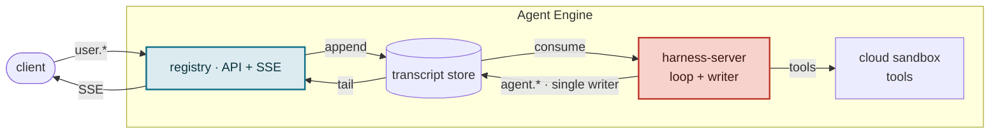
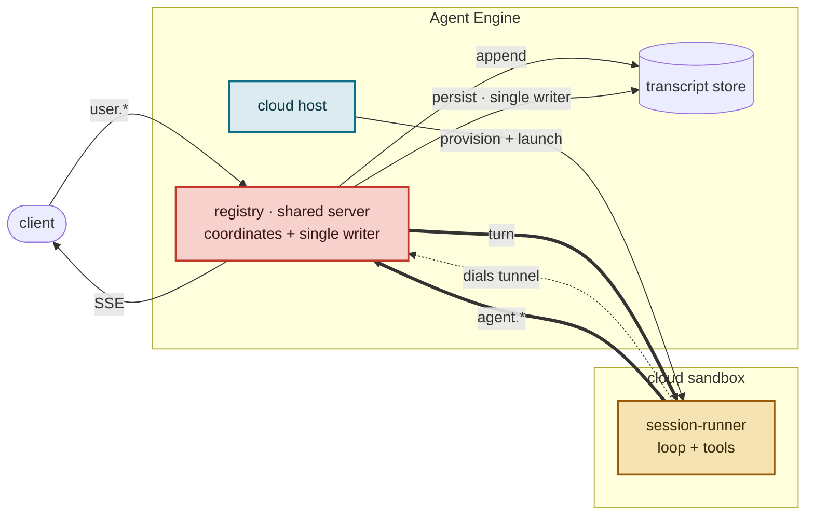
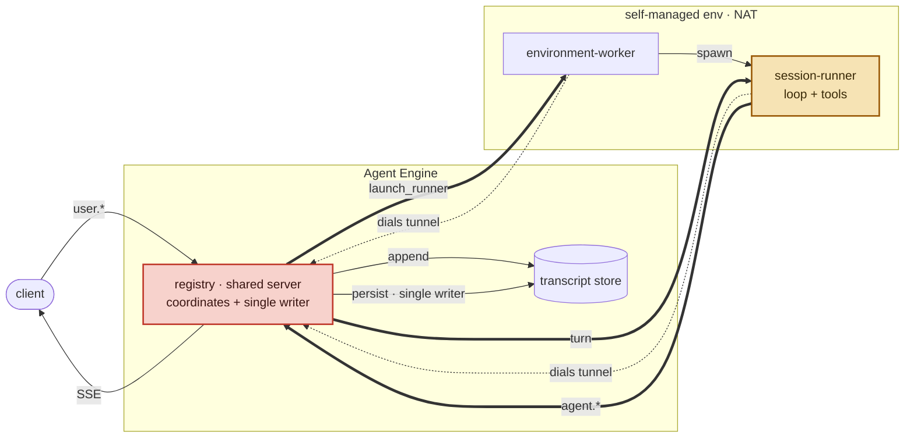

# Deployment Topologies

Two axes govern execution: `mode` decides where the agent loop runs; the environment `target` decides where the sandbox runs. Registry coordinates runner-owned Sessions over the tunnel. Harness capabilities select the execution owner: `harness-server` runs cloud `separate` and cloud `claude_code`, `codex_sdk`, and `pi_sdk` `colocated`; all self-hosted Sessions and other cloud colocated harnesses use `session-runner`.

See [`architecture.md`](./architecture.md) for the component model and [`harness-modes.md`](./harness-modes.md) for the per-agent `metadata.harness`/`metadata.mode` annotation. This doc is the canonical reference for how the two axes combine into four topologies, who is responsible for what, and the implemented routing boundaries.

## The two axes

|                                          | `target = cloud` (Orca-managed sandbox)                                                                                                      | `target = self_hosted` (self-managed sandbox, via tunnel)                   |
| ---------------------------------------- | -------------------------------------------------------------------------------------------------------------------------------------------- | --------------------------------------------------------------------------- |
| `mode = separate` (Claude SDK)           | loop in harness-server; tools in the cloud sandbox — **harness-server drives**                                                               | Claude SDK loop + tools on the self-managed host — **registry coordinates** |
| `mode = colocated` (loop in the sandbox) | loop + tools in the cloud sandbox — **harness-server drives `claude_code`, `codex_sdk`, and `pi_sdk`; Registry coordinates other harnesses** | loop + tools in the self-managed sandbox — **registry coordinates**         |

## Flow: `separate` · cloud

## Flow: `colocated` · cloud

This diagram shows Registry-owned CLI harnesses. Cloud `claude_code`,
`codex_sdk`, and `pi_sdk` follow the cloud separate transcript flow above, with
the SDK inside the shared sandbox image and an HTTP/SSE bridge back to
harness-server.

## Flow: `colocated` · self_hosted

Both Claude SDK identities retain the `separate` annotation on self-hosted Agents, but execute through the Registry runner on the self-managed host.

## Responsibility split

| Responsibility               | registry                                                   | harness-server                                                             | session-runner        |
| ---------------------------- | ---------------------------------------------------------- | -------------------------------------------------------------------------- | --------------------- |
| Client API + SSE             | yes                                                        | no                                                                         | no                    |
| Coordinate `colocated` turns | runner-owned Sessions                                      | cloud `claude_code`, `codex_sdk`, `pi_sdk` HTTP bridge                     | serves `/v1/runner/*` |
| Run Claude SDK loop          | —                                                          | cloud                                                                      | self-hosted           |
| Run `colocated` loop + tools | —                                                          | —                                                                          | in the sandbox        |
| Single writer of `agent.*`   | runner-owned Sessions                                      | cloud separate, and cloud `colocated` `claude_code`, `codex_sdk`, `pi_sdk` | no                    |
| Transcript store             | in-process append (Postgres recommended; backend-agnostic) | consumer (Kafka retained)                                                  | —                     |
| Transport to the sandbox     | WS tunnel (all locations)                                  | direct (cloud sandbox)                                                     | dials the tunnel      |

## Implemented capabilities

| Capability                                                                                                                                                | Status |
| --------------------------------------------------------------------------------------------------------------------------------------------------------- | ------ |
| Shared-server coordinator (persist-before-forward single writer, distributor, tunnel registry, recovery, snapshot delivery) — registry `src/tunnel/*`     | built  |
| WS tunnel transport (`@orca/harness-tunnel`)                                                                                                              | built  |
| `colocated` engine: `session-runner` (`/v1/runner/*`, 10 providers, socket-free dispatcher)                                                               | built  |
| Self-hosted host + affinity routing (`environment-worker`, `sessions.runner_id`, claims)                                                                  | built  |
| Orca-managed cloud host — registry provisions the cloud Environment, mints its Environment Token, and waits for the runner to dial in                     | built  |
| Shared execution-owner routing keeps cloud `claude_code`, `codex_sdk`, and `pi_sdk` `colocated` in harness-server and skips Registry-owned Sessions there | built  |
| Registry single-writer for runner-owned Sessions (backend-agnostic; broker-free on the recommended Postgres backend); Kafka retained for `separate`       | built  |

Deferred deployment and runner-parity work is tracked in [`roadmap.md`](./roadmap.md).
